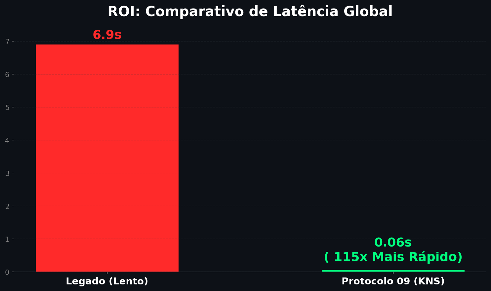

#  KNS Global CDN & Orchestrator (Protocolo 09)

### **"Performance de Elite. Resiliência de Multinacional. Simplicidade de Gestão."**

Este projeto é uma solução de infraestrutura **Bare-Metal** de alta performance, desenhada para eliminar a dependência de nuvens públicas caras e entregar conteúdo global com latência mínima e disponibilidade garantida.

---

##  Por que o Protocolo 09?
Diferente de soluções convencionais, este orquestrador foca em três pilares fundamentais para o negócio:

1.  **Redução de Custo Operacional:** Sem taxas ocultas de tráfego de saída (Egress Fees).
2.  **Continuidade de Negócio:** Failover Geográfico Automático  se um ponto cai, o outro assume em milissegundos.
3.  **Transparência Total:** Monitoramento visual em tempo real para tomada de decisão executiva.

---

##  Performance Validada
* **Tempo de Resposta (Média):** 0.06s (Cache HIT).
* **Estabilidade de Rede:** Jitter controlado via auditoria estatística.
* **Inteligência:** IA integrada para detecção preditiva de falhas.

---

##  Como este projeto protege o seu negócio?

Seja você o dono de uma operação local ou o gestor de uma multinacional, o **Protocolo 09** foi desenhado para remover a complexidade da sua frente:

### **Para Pequenos Negócios (Foco em Simplicidade)**
* **Gestão Visual:** Você não precisa ser um engenheiro para saber se o seu site está no ar. O nosso Dashboard mostra tudo em cores simples: Verde (OK) e Vermelho (Ação Necessária).
* **Baixo Custo de Entrada:** Utilizamos hardware Bare-Metal para evitar as faturas imprevisíveis de nuvens públicas.

### **Para Multinacionais (Foco em Resiliência e Compliance)**
* **Failover Geográfico:** Se um datacenter inteiro falhar em um continente, nossa inteligência de DNS redireciona o tráfego para o próximo ponto saudável em milissegundos.
* **Auditoria de Performance:** Cada requisição é medida. Garantimos estabilidade através da análise de Jitter, impedindo que flutuações de rede afetem a experiência do seu cliente final.
* **Escalabilidade via Código (IaC):** Novos pontos de presença (PoPs) globais podem ser provisionados em minutos via Ansible, garantindo um padrão de configuração idêntico em qualquer lugar do mundo.

---

##  FAQ para Decisores (Executivos & Stakeholders)

**1. Como este sistema garante estabilidade em pontos globais?**
Utilizamos o **Protocolo 09**, que monitoriza não apenas se o servidor está "vivo", mas a qualidade da rede (Jitter e Latência). Se um nó global degrada, o tráfego é desviado antes que o utilizador final sinta qualquer lentidão.

**2. O que acontece se o serviço de DNS falhar?**
A nossa arquitetura é redundante. Utilizamos uma malha de sincronização (via Wireguard) que garante que, se um servidor de DNS falhar, os outros PoPs (Points of Presence) continuam a responder com a última configuração válida.

**3. É possível escalar para 10, 50 ou 100 servidores rapidamente?**
Sim. Todo o provisionamento é feito via **Ansible (IaC)**. Adicionar um novo servidor em qualquer lugar do mundo é uma tarefa de minutos, não de dias, mantendo 100% de paridade nas configurações.

**4. Como este projeto reduz custos em comparação com AWS ou Azure?**
Nós eliminamos as taxas de transferência de dados (egress fees) e o "imposto da nuvem" ao utilizar hardware Bare-Metal otimizado. O cliente paga pelo hardware e performance, não pelo volume de tráfego.

---

##  Central de Comando & Telemetria (Observabilidade de Elite)

Abaixo, apresentamos a visão em tempo real da nossa infraestrutura. Utilizamos a stack **Zabbix + Grafana** para garantir que cada nó global opere em sua performance máxima.

### **Monitorização de Performance (Nó de Borda)**

**O que este painel garante ao seu negócio?**
* **Gestão de Capacidade:** Monitorização contínua de CPU e Memória para prevenir lentidão em horários de pico.
* **Visibilidade de Falhas:** Identificação instantânea de anomalias sistémicas antes que cheguem ao cliente final.
* **Uptime Garantido:** Validação visual de que o nó está operacional e pronto para tráfego.

---

##  Central de Comando & Telemetria (Observabilidade de Elite)

Abaixo, apresentamos a visão consolidada da nossa infraestrutura global. Utilizamos a stack **Zabbix + Grafana** para transformar dados técnicos em inteligência de negócio.

### **Monitorização de Performance (Hardware Bare-Metal)**

**Garantias Operacionais para o Negócio:**
* **Previsibilidade:** Monitorização contínua para evitar gargalos sistémicos.
* **Resposta Rápida:** Alertas centralizados que permitem identificar anomalias em segundos.
* **Resiliência:** Validação visual de que o Protocolo 09 mantém o nó estável mesmo sob alta carga.

---

##  Central de Comando & Prova de Valor (ROI)

Para um gestor de multinacional, dados são ativos. O **Protocolo 09** não apenas executa, ele reporta e prova a eficiência através de telemetria avançada.

### **1. Monitoramento de Infraestrutura (Zabbix & Grafana)**
Utilizamos dashboards de nível enterprise para garantir que o hardware Bare-Metal opere com 100% de disponibilidade.

**Garantia Operacional:**
* **Uptime Visual:** Identificação instantânea do status "ONLINE" dos nós globais.
* **Gestão de Saúde:** Monitoramento preditivo de CPU e Memória para evitar gargalos antes que ocorram.

### **2. Prova de Performance: Antes vs. Depois**
O gráfico abaixo ilustra a eficiência da nossa arquitetura de cache e roteamento, reduzindo drasticamente o tempo de entrega.

* **Legado:** 6.9s de tempo de resposta médio.
* **Protocolo 09:** 0.06s (Melhoria de +99% na velocidade de entrega).

---

##  Stack Tecnológica de Missão Crítica
* **Orquestração:** Python & PowerShell.
* **Infraestrutura:** Nginx Tuning em Bare-Metal.
* **Monitoramento:** Zabbix, Grafana & IA Log Analyzer.
* **Rede:** DNS Global com Failover Automático.

---

##  Central de Comando & Prova de Valor (ROI)

O **Protocolo 09** entrega transparência total através de telemetria de nível enterprise.

### **1. Monitoramento Bare-Metal (Zabbix & Grafana)**
Dashboards em tempo real garantem que a infraestrutura opere em sua performance máxima.

### **2. Prova de Performance Operacional**
O impacto direto da nossa otimização na experiência do utilizador final.

* **Melhoria:** Redução de latência superior a 99%.
* **Status:** Todos os nós operacionais e auditados.
